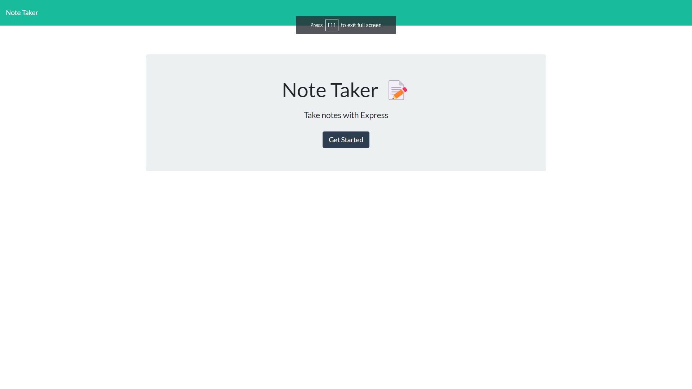
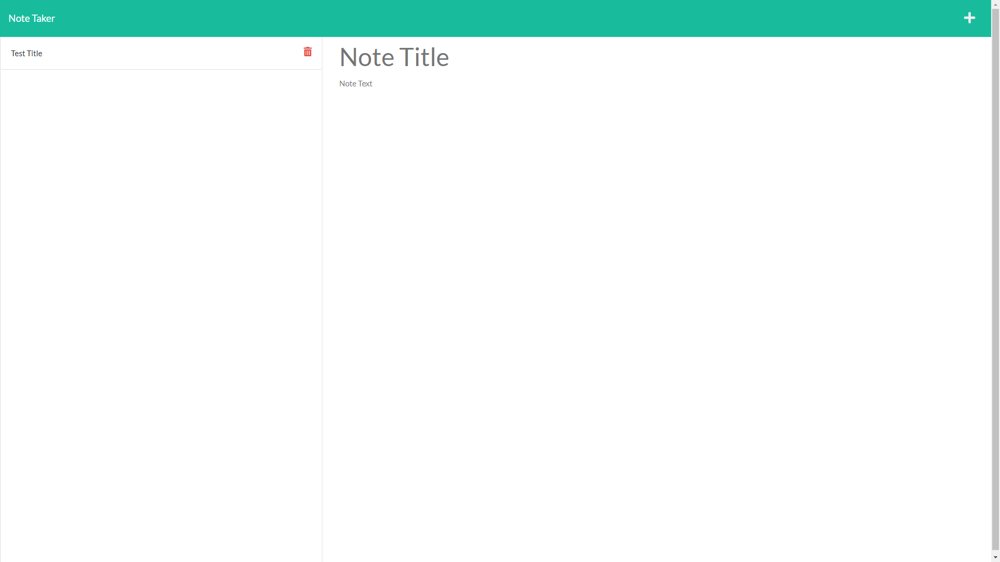

# Note Taker Starter Code

## Description
This note take application will let you write and create new notes with just a few clicks. You can add multiple side of notes or modify any exisiting notes. 

Future development: publish this project on heroku create a function to let users save and delete notes. 

## Table of Contents

* [Usage](#usage)
* [Tests](#tests)
* [License](#license)
* [Questions and Contact](#questions_and_contact)

## Usage

### An example of how the project will looks like. This is the home page.

### This is the page on where you can start taking your note.

## Tests
There are no test require for this application

## License 
This GitHub repository utilizes the Unlicense License.

## Questions and Contact
You can contact me with any inquiries at [minhcao1117@gmail.com](mailto:minhcao1117@gmail.com)